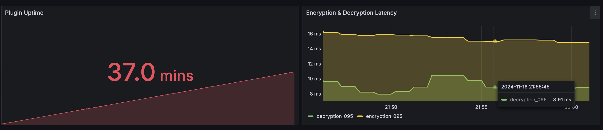

# Prometheus Metrics
Beginning with `v1.0.0` `vault-kubernetes-kms` exposes metrics under `:8080/metrics` (change with `-health-port` or setting `HEALTH_PORT`).

The following metrics are available:

## Available Prometheus Metrics
| Metric Name                                                         | Type      | Description                                         |
|---------------------------------------------------------------------|-----------|-----------------------------------------------------|
| `vault_kubernetes_kms_decryption_operation_duration_seconds_bucket` | Histogram | duration of decryption operations in seconds        |
| `vault_kubernetes_kms_encryption_operation_duration_seconds_bucket` | Histogram | duration of encryption operations in seconds        |
| `vault_kubernetes_kms_decryption_operation_errors_total`            | Counter   | total number of errors during decryption operations |
| `vault_kubernetes_kms_encryption_operation_errors_total`            | Counter   | total number of errors during encryption operations |
| `vault_kubernetes_kms_token_expiry_seconds`                         | Gauge     | time remaining until the current token expires      |
| `vault_kubernetes_kms_token_renewals_total`                         | Counter   | total number of token renewals                      |

Including the metrics defined in the [Prometheus Process Collector](https://github.com/prometheus/client_golang/blob/main/prometheus/process_collector.go#L38) (when running on `Linux`).

Those metrics allow you to define your own Grafana Dashboard:

